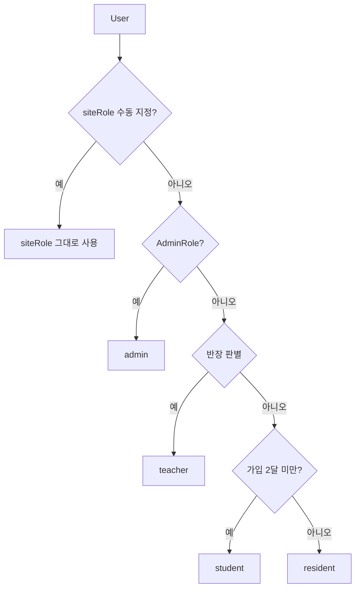
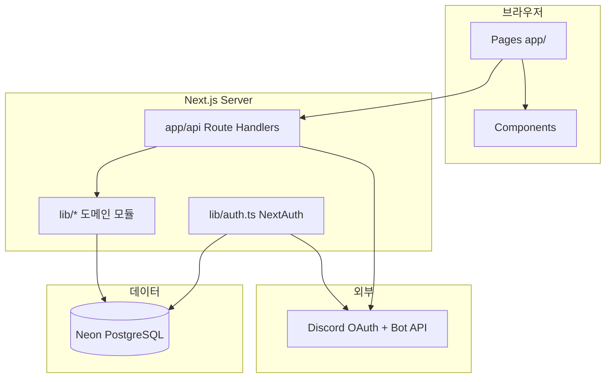
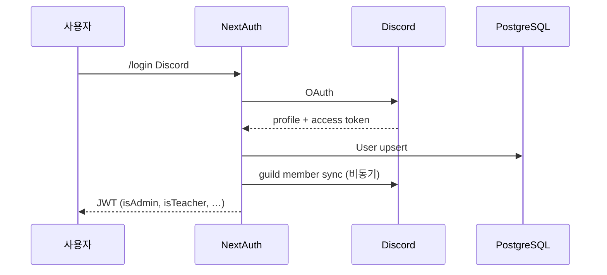

<div align="center">


# 🎮 정착지원국

**평화로운 게임마을** — 게임 멘토링 클래스 · 수강 신청 · 반장 관리 · 졸업면담

> 수달반 🦦 · 사자반 🦁 · 여우반 🦊 — 함께 성장하는 게임 클래스

<br/>

[](https://nextjs.org/)
[](https://react.dev/)
[](https://www.typescriptlang.org/)
[](https://tailwindcss.com/)
[](https://www.prisma.io/)
[](https://neon.tech/)
[](https://discord.com/developers)

<br/>

**🌍 프로덕션:** [ow-school.vercel.app](https://ow-school.vercel.app) · **📦 저장소:** [github.com/zyansuh/ow_school](https://github.com/zyansuh/ow_school)

</div>

---

## 목차

1. [프로젝트 소개](#-이-프로젝트는)
2. [사이트 이용자 역할](#-사이트-이용자-역할)
3. [주요 기능](#-주요-기능)
4. [사용 기술](#-사용-기술-tech-stack)
5. [아키텍처 · 소스 구조](#️-아키텍처)
6. [빠른 시작](#-빠른-시작)
7. [배포 · CI](#-vercel-배포)
8. [Discord 연동](#-discord-서버-연동)
9. [포인트 · 반 안내](#-포인트-시스템)
10. [API 레퍼런스](#-api-레퍼런스)
11. [데이터 모델](#️-데이터-모델)
12. [개발 규칙](#-개발-규칙)
13. [트러블슈팅](#-트러블슈팅)

---

## 📖 이 프로젝트는?

**정착지원국**(브랜드명: **평화로운 게임마을**, `SITE_NAME` / `SITE_TAGLINE`)은 Discord 커뮤니티 기반 **게임 멘토링 프로그램** 운영용 풀스택 웹 앱입니다.

| 구분 | 설명 |
|------|------|
| **프론트** | Next.js App Router · React 19 · Tailwind (다크 테마 고정) |
| **백엔드** | 동일 Next.js 프로젝트의 Route Handlers (`app/api/`) |
| **인증** | NextAuth.js v5 + Discord OAuth2 |
| **DB** | PostgreSQL (Neon) + Prisma ORM |
| **배포** | Vercel (Cron으로 Discord 일괄 동기화) |

### 이용자별 기능

| 역할 | 대표 경로 | 할 수 있는 것 |
|------|-----------|----------------|
| **마을주민** | `/`, `/mypage` | 반·반장 둘러보기, 커뮤니티 참여 |
| **학생** | `/apply`, `/interview` | 수강 신청, 졸업면담, 담당 반장 배정 |
| **반장** | `/teacher` | 담당 학생 관리, 통계 |
| **관리자** | `/admin` | 전체 운영·역할·졸업·Discord 동기화 |

---

## 👥 사이트 이용자 역할

관리자는 [`/admin/users`](https://ow-school.vercel.app/admin/users)에서 역할을 **수동 지정**할 수 있습니다. `User.siteRole`이 비어 있으면 **자동 분류**가 적용됩니다.

### 역할 정의

| 표시 | DB 값 | 자동 분류 우선순위 |
|------|-------|-------------------|
| 관리자 | `admin` | `AdminRole` 테이블 존재 |
| 반장 | `teacher` | Discord `신입반교사` 역할 · `Teacher.discordUserId` · Teacher 닉 매칭 |
| 학생 | `student` | Discord **서버 가입 2달 미만** (`guildJoinedAt` 기준) |
| 마을주민 | `resident` | 가입 2달 이상 · 미가입 · 위에 해당 없음 |

### 역할 해석 흐름



### 구현 · 검증

| 파일 | 역할 |
|------|------|
| `src/lib/users/role.ts` | `getUserRole`, `inferUserRole`, `isStudentUser` |
| `src/lib/discord/guild-tenure.ts` | `guildJoinedAt`, 2달 기준 `isStudentByGuildTenure` |
| `src/lib/users/display.ts` | 관리자 화면 `displayNickname` 우선 표시 |

```bash
# DB 없이 역할 분류 순수 함수 검증
node scripts/verify-user-role.mjs
```

**참고**

- `guildJoinedAt`은 Discord Member API `joined_at` 동기화 값. 없으면 **최초 로그인일(`createdAt`)** 을 보조 기준으로 사용.
- **학생 관리**(`/admin/students`)·홈 통계의 “학생 수”는 `student` 역할만 집계 (마을주민 제외).
- **메인 홈 통계**(학생 수·반장 수·졸업생 수·클래스 카드 인원)는 DB 실제 값과 **표시용 오버라이드**를 분리합니다. 관리자가 메인에서 수정한 숫자는 `SiteSetting`에만 저장되며, `User`·`Teacher` 등 운영 데이터는 변경되지 않습니다.
- 관리자로 `siteRole=admin` 지정 시 `AdminRole` 부여, 다른 역할로 변경 시 `AdminRole` 해제.

---

## ✨ 주요 기능

### 🌟 공개 · 일반 사용자

| 기능 | 경로 | 설명 |
|------|------|------|
| 메인 | `/` | Hero, 반 카드, 담당 반장 안내, 공지 (ISR `revalidate: 60`) · **관리자: 통계 카드 클릭 수정** |
| 반별 | `/classes/[slug]` | `overwatch` · `pubg` · `valorant` — `TeacherCard`, 수강 신청 링크 |
| 반장 목록 | `/teachers` | `/#classes`로 리다이렉트 (메인 반 섹션) |
| 반장 상세 | `/teachers/[id]` | 프로필, MBTI, 담당 학생, 신청 CTA |
| 수강 신청 | `/apply?class={slug}` | 닉네임, Discord, 플레이 시간, 담당 반장 |
| 졸업면담 | `/interview` | 제출·수정, 졸업/동호회 포인트 |
| 졸업후기 | `/graduation` | 졸업후기 FAB (홈 등) |
| 마이페이지 | `/mypage` | 프로필, 서버 닉 변경, 신청·면담 내역, Discord 새로고침 |
| 로그인 | `/login` | Discord OAuth |

### 👨‍🏫 반장 포털

| 기능 | 경로 |
|------|------|
| 대시보드 | `/teacher` |
| 담당 학생 | `/teacher/students` |

세션 `isTeacher`는 `getUserRole === 'teacher'` 기준 (JWT 갱신).

### 🔐 관리자 (`/admin`)

> Discord 로그인 + `AdminRole` + `middleware.ts`에서 `token.isAdmin` 검사

| 메뉴 | URL | 핵심 기능 |
|------|-----|-----------|
| 대시보드 | `/admin` | 월별 차트, 반별 통계, 동기화 요약 · 메인 홈 표시 통계 안내 |
| Discord 동기화 | `/admin/discord-sync` | 전체 유저 닉·역할·가입일, 반장 연결 검증 |
| **사이트 사용자** | `/admin/users` | 역할 지정, 표시 닉, **졸업/졸업 취소**, 서버 가입일 |
| 학생 관리 | `/admin/students` | 담당 반장 변경, 졸업 처리 |
| 졸업생 | `/admin/graduated` | 졸업생 목록, **졸업 취소** |
| 반장 관리 | `/admin/teachers` | CRUD, 활동/비활성, 정원, 복수 반 |
| 신청 관리 | `/admin/applications` | 수강 신청 내역 |
| 졸업면담 | `/admin/interviews` | 조회·삭제 (감사 로그) |
| 포인트 | `/admin/points` | 월별 집계, 엑셀 |
| 졸업후기 | `/admin/graduation-reviews` | 조회 |
| 관리자 목록 | `/admin/admins` | 권한 부여·해제 |
| 권한 요청 | `/admin/roles` | `AdminRoleRequest` 승인·거절 |

### 🎓 졸업 · 졸업 취소

| 동작 | DB 변경 | 비고 |
|------|---------|------|
| **졸업** | `status → graduated`, `classId`/`teacherId` null | 반장 `currentStudents` 재계산 |
| **졸업 취소** | `status → active`, 마지막 담당·반 복원 | 면담·승인 신청 이력 기준 (`students/assignment.ts`) |

**졸업 취소 UI:** `/admin/graduated`, `/admin/users` (졸업 관리 열), API `PATCH` `statusAction: ungraduate`

### 🔗 Discord 연동 요약

| 항목 | 구현 |
|------|------|
| 사용자 식별 | `User.discordId` (닉 변경해도 유지) |
| 학생↔반장 | `User.teacherId` → `Teacher` |
| 일반 표시명 | 서버 닉 → 글로벌 → username |
| 관리자 표시명 | `displayNickname` → 서버 닉 → … |
| 길드 동기화 | `lib/discord/guild.ts`, TTL `GUILD_SYNC_TTL_SEC` (기본 300초) |
| 일괄 동기화 | `lib/admin/discord-sync.ts`, Cron `0 4 * * *` UTC |

---

## 🧰 사용 기술 (Tech Stack)

| 분류 | 기술 | 비고 |
|------|------|------|
| 프레임워크 | Next.js 15 | App Router, SSR/ISR, Middleware |
| UI | React 19 | RSC + Client Components |
| 언어 | TypeScript 5.5 | `npm run lint` = `tsc --noEmit` |
| 스타일 | Tailwind 3.4 | `styles/design-system.ts` (`ds` 토큰) |
| 컴포넌트 | Radix UI + CVA | Dialog, Select, Dropdown … |
| 인증 | NextAuth v5 beta | Discord Provider, JWT 세션 |
| ORM | Prisma 6.5 | `migrate deploy` (Vercel 빌드) |
| DB | Neon PostgreSQL | Pooled + Direct URL |
| 검증 | Zod | API body/query |
| 알림 | Sonner | 토스트 |
| 엑셀 | xlsx | 포인트 다운로드 |
| 이미지 | sharp | WebP (`npm run images:optimize`) |
| CI | GitHub Actions | lint + build |

---

## 🏗️ 아키텍처



### 저장소 루트

```
peaceful_game/
├── package.json
├── README.md
├── vercel.json              # Cron: /api/cron/discord-sync
├── .env.example
├── .github/workflows/ci.yml
├── scripts/
│   ├── vercel-build.mjs     # prisma generate → migrate deploy → next build
│   ├── verify-user-role.mjs # 역할 분류 단위 검증
│   ├── refactor-imports.mjs # import 경로 일괄 치환 (리팩터용)
│   └── optimize-images.mjs
├── prisma/
│   ├── schema.prisma
│   ├── seed.ts
│   └── migrations/          # 버전별 SQL (아래 마이그레이션 목록)
├── public/images/           # 배너·마스코트·로고
├── docs/ROADMAP.md
└── src/
    ├── middleware.ts        # /admin/* → isAdmin JWT 검사
    ├── app/                 # 라우팅 (변경 최소화)
    ├── components/          # UI · 도메인 컴포넌트
    ├── hooks/               # 클라이언트 훅
    ├── lib/                 # 서버·공유 비즈니스 로직
    ├── styles/              # Tailwind 디자인 토큰
    └── types/
```

### `src/lib/` — 도메인별 모듈 맵

> import 예: `@/lib/teacher/auth`, `@/lib/users/role`

| 폴더 | 파일 | 설명 |
|------|------|------|
| **루트** | `auth.ts` | NextAuth handlers · 세션 JWT 동기화 |
| | `prisma.ts` | Prisma 클라이언트 싱글톤 |
| | `api-helpers.ts` | `requireUser` / `requireAdminUser` / `requireTeacherUser` |
| | `constants.ts` | `GAME_CLASSES`, `DEFAULT_ADMIN_USERNAMES` |
| | `site-brand.ts` | `SITE_NAME`, `SITE_TAGLINE` |
| | `points.ts` | 졸업·동호회 포인트 상수 |
| | `monthly-stats.ts` | 관리자 월별 통계 오버라이드 |
| | `db-fallbacks.ts` | DB 실패 시 기본값 |
| **auth/** | `config.ts`, `url.ts`, `errors.ts`, `rbac.ts` | OAuth 설정, URL, 오류, 관리자 RBAC |
| **discord/** | `guild.ts` | Bot API · 닉·역할·가입일 sync |
| | `id.ts` | Snowflake 검증 |
| | `guild-membership.ts` | DB `isInGuild` 단일 기준 |
| | `guild-tenure.ts` | 2달 학생 판별 |
| | `notify.ts` | 웹훅 · DM |
| **admin/** | `discord-sync.ts` | 관리자 일괄 동기화 리포트 |
| | `points.ts` | 월별 포인트 리포트 |
| | `role-requests.ts` | 권한 요청·감사 로그 |
| | `discord-user-lookup.ts` | Discord 유저 조회 |
| **teacher/** | `identity.ts` | 반장 엔티티 해석 |
| | `auth.ts`, `classes.ts`, `counts.ts` | Discord ID, 반 매핑, 학생 수 |
| | `students.ts`, `assigned-students.ts` | 담당 학생 API·공개 프로필 |
| | `recruiting.ts`, `display.ts`, `activity.ts` | 모집 상태, UI 라벨, 활동 시간 |
| | `discord-field.ts`, `discord-link.ts` | Discord 필드 검증·백필 |
| | `delete.ts`, `query.ts` | 삭제, 목록 쿼리 |
| **students/** | `users.ts` | 활성·졸업 학생 조회/카운트 |
| | `assignment.ts` | 담당 반장 배정·복원 |
| | `graduation.ts` | 졸업·졸업 취소 |
| **users/** | `role.ts`, `display.ts`, `header.ts` | 역할, 표시명, 헤더 라벨 |
| **home/** | `stats.ts`, `class-stats.ts`, `site-stats-override.ts`, `ensure-classes.ts` | 홈 통계, 표시 오버라이드, 반 자동 생성 |
| **interviews/** | `access.ts`, `utils.ts` | 면담 권한, 동아리명 파싱 |
| **applications/** | `policy.ts`, `service.ts`, `status.ts` | 신청 정책·생성·상태 변경 |
| **notifications/** | `application-submitted.ts`, `interview-submitted.ts` | Discord 알림 |
| **utils/** | `index.ts` | `cn`, `formatDate`, `STATUS_LABELS` |
| | `async.ts`, `segment.ts`, `form-options.ts`, `mbti.ts` | 병렬 처리, dynamic export, 폼 옵션 |

### `src/components/` — 컴포넌트 맵

| 폴더 | 주요 파일 | 용도 |
|------|-----------|------|
| `ui/` | `button`, `badge`, `card`, `input`, `dialog`, `data-table`, `stat-card`, `skeleton` | 공통 UI (shadcn 스타일) |
| `layout/` | `main-layout`, `site-header`, `site-footer`, `space-background` | 전역 레이아웃 |
| `providers/` | `session-provider` | NextAuth SessionProvider |
| `cards/` | `class-card`, `teacher-card` | 홈·반 카드 |
| `home/` | `home-content`, `home-site-stats` (`HomeStatsSection`), `interview-fab` | 메인 페이지 본문 · 관리자 통계 편집 |
| `apply/` | `teacher-select-card` | 수강 신청 반장 선택 |
| `teacher/` | `teacher-activity-fields` | 반장 폼 활동 시간 |
| `interview/` | `graduation-review-fab` | 졸업후기 모달 |
| **admin/** | `admin-nav`, `admin-page-header` | 관리자 레이아웃 |
| | `user-display-nick-edit`, `user-site-role-edit`, `user-graduation-actions` | 사이트 사용자 관리 |
| | `discord-user-search`, `discord-sync-panel` | Discord 연동 UI |
| | `monthly-stats-editor`, `admin-grant-search` | 통계·권한 |
| **admin/students/** | `student-teacher-assign`, `student-display-nick-edit` | 학생 관리 |
| **admin/teachers/** | `teacher-table`, `teacher-form-dialog` | 반장 CRUD |

### `src/hooks/`

| 경로 | 설명 |
|------|------|
| `auth/use-discord-sign-in.ts` | `signInWithDiscord`, 재시도 |
| `admin/use-admin-teachers.ts` | 반장 폼·CRUD 상태 |
| `admin/use-discord-sync.ts` | 동기화 API·리포트 |
| `apply/use-apply-form.ts` | 수강 신청 폼 |
| `mypage/use-mypage.ts` | `/api/me` 데이터 |

### `src/styles/`

| 파일 | 설명 |
|------|------|
| `design-system.ts` | `ds` — `pageGap`, `sectionTitle`, 카드 패딩 등 |
| `admin/index.ts` | 레거시 `adminStyles` (신규 코드는 `ds` 권장) |

글로벌 CSS: `src/app/globals.css`

### `src/app/api/` — 라우트 개요

| prefix | 인증 | 용도 |
|--------|------|------|
| `/api/auth/*` | — | NextAuth, 쿠키 리셋 |
| `/api/health`, `/api/classes`, `/api/teachers` | 공개/선택 | 헬스, 반, 반장 |
| `/api/me`, `/api/applications`, `/api/interviews` | 로그인 | 마이페이지, 신청, 면담 |
| `/api/teacher/*` | 반장 | 담당 학생·통계·프로필 |
| `/api/admin/*` | 관리자 | 전체 운영 API |
| `/api/cron/discord-sync` | `CRON_SECRET` | Vercel Cron |

---

## 🚀 빠른 시작

### 사전 준비

Node.js 18+, npm 9+, [Neon](https://neon.tech) DB, [Discord Application](https://discord.com/developers/applications)

### 설치

```bash
git clone https://github.com/zyansuh/ow_school.git peaceful_game
cd peaceful_game
npm install
cp .env.example .env
# .env 값 채운 뒤
npm run db:setup    # 로컬 최초: db push + seed
npm run dev         # http://localhost:3000
```

### 환경 변수

| 변수 | 필수 | 설명 |
|------|:----:|------|
| `DATABASE_URL` | ✅ | Neon **Pooled** (`...-pooler...`) |
| `DIRECT_URL` | ⭐ | Neon **Direct** — `migrate deploy`용 |
| `AUTH_SECRET` | ✅ | `openssl rand -base64 32` |
| `NEXTAUTH_URL` | ✅ | 로컬 `http://localhost:3000` |
| `DISCORD_CLIENT_ID` / `SECRET` | ✅ | OAuth |
| `DISCORD_GUILD_ID` | ⭐ | 서버 ID (미가입 로그인 차단) |
| `DISCORD_BOT_TOKEN` | ⭐ | 닉 변경·동기화 |
| `GUILD_SYNC_TTL_SEC` | — | 캐시 TTL (기본 300) |
| `DEFAULT_ADMIN_DISCORD_IDS` | — | 쉼표 구분 기본 관리자 ID |
| `DISCORD_WEBHOOK_URL` | — | 면담·권한 알림 |
| `CRON_SECRET` | — | Cron 인증 |
| `RUN_DB_SEED` | — | Vercel 빌드 시 seed (`true`만) |

**Redirect URI:** `{NEXTAUTH_URL}/api/auth/callback/discord`

### npm 스크립트

| 명령 | 설명 |
|------|------|
| `npm run dev` | 개발 서버 |
| `npm run build` | `scripts/vercel-build.mjs` (migrate + next build) |
| `npm run lint` | `tsc --noEmit` |
| `npm run db:push` / `db:seed` / `db:setup` | Prisma |
| `npm run images:optimize` | WebP 변환 |

---

## 🌍 Vercel 배포

1. Neon에서 Pooled → `DATABASE_URL`, Direct → `DIRECT_URL`
2. Vercel Environment Variables (따옴표 없이)
3. `NEXTAUTH_URL=https://ow-school.vercel.app`
4. Redeploy → 빌드 시 `prisma migrate deploy` (실패 시에도 Next 빌드는 계속, 로그 확인)
5. **`RUN_DB_SEED` 설정하지 않음** (운영 데이터 보존)
6. 배포 후 `/admin/discord-sync` 1회 실행

### CI (GitHub Actions)

`push`/`PR` → `main`에서 `npm run lint` + `npm run build` (CI용 더미 `DATABASE_URL`)

### Prisma 마이그레이션 이력

| 마이그레이션 | 내용 |
|-------------|------|
| `20250623115959_baseline` | 초기 스키마 |
| `20250623120000_interview_points_system` | 면담·포인트 |
| `20250623140000_interview_audit_nick_fix` | 감사·닉 수정 |
| `20250623150000_teacher_discord_user_id` | `Teacher.discordUserId` |
| `20250623210000_admin_role_requests` | 관리자 권한 요청 |
| `20250623220000_drop_site_display_name` | 레거시 필드 제거 |
| `20250623230000_teacher_multi_class` | 반장 복수 반 |
| `20250624100000_user_display_nickname` | `displayNickname` |
| `20250625120000_user_site_role` | `siteRole` |
| `20250625140000_user_guild_joined_at` | `guildJoinedAt` |
| `20250625200000_content_posts` | `ContentPost` · `ContentImage` (컨텐츠 소개) |

> 메인 홈 통계 오버라이드는 **기존 `SiteSetting` 테이블**만 사용합니다. 별도 마이그레이션 없음.

---

## 📊 메인 홈 통계 수정 (관리자)

메인 페이지(`/`)의 **학생 수 · 반장 수 · 졸업생 수**와 **클래스 카드 인원**(현재/정원)은 기본적으로 DB에서 자동 집계됩니다. 운영상 화면에만 다른 숫자를 보여줘야 할 때 관리자가 **표시값**을 지정할 수 있습니다.

### 동작 원리

| 구분 | 설명 |
|------|------|
| **DB 집계값** | `User`·`Teacher`·담당 배정 등 실제 데이터 기준 자동 계산 |
| **표시 오버라이드** | `SiteSetting` 키 `homeSiteStatsOverride` · `homeClassStatsOverride` (JSON) |
| **화면 표시** | 오버라이드가 있으면 해당 값, 없으면 DB 집계값 |

**중요:** 오버라이드는 **표시용**입니다. 학생 배정·반장 정원·졸업 처리 등 **운영 데이터는 절대 수정하지 않습니다.**

### 관리자 UI (메인 홈)

1. Discord 로그인 + 관리자 권한(`AdminRole`)으로 `/` 접속
2. 상단 통계 카드(학생 수·반장 수·졸업생 수) **클릭** 또는 우측 **「통계 수정」** 버튼
3. 클래스 섹션의 **「클래스 인원 수정」** 버튼으로 동일 모달 진입
4. 각 항목에서 **「DB 자동」** 체크 시 실제 집계값 사용, 해제 후 숫자 입력 시 표시값 고정
5. 저장 후 `revalidateTag`로 홈 캐시 갱신 (최대 1~2분 ISR과 병행)

### 반장(선생님)별 정원·담당 학생 수

| 수정 대상 | 경로 | 비고 |
|-----------|------|------|
| **반장 최대 정원** (`maxStudents`) | `/admin/teachers` → 수정 → 「최대 인원」 | DB `Teacher.maxStudents` 변경 |
| **담당 학생 수** (실제) | 학생 배정·졸업·신청 승인으로 자동 반영 | `User.teacherId` + 역할 필터 집계 |
| **메인 카드 인원** (표시만) | 메인 홈 통계 수정 모달 | 클래스별 current/max 오버라이드 |

반장 카드의 `담당 학생 X/Y명`은 **실시간 DB 집계**(`getActiveStudentCountsByTeacher`)를 사용합니다. 메인 클래스 카드의 `X/Y명`만 오버라이드와 병합됩니다.

### API

```http
GET /api/admin/stats/home
Authorization: (관리자 세션)

PUT /api/admin/stats/home
Content-Type: application/json

{
  "site": {
    "students": 42,    // null = DB 자동
    "teachers": null,
    "graduated": 10
  },
  "classes": {
    "overwatch": { "current": 5, "max": 20 },
    "pubg": { "current": null, "max": null }
  }
}
```

응답에는 `computed`(DB 집계)·`override`(저장값)·`display`(화면 표시)가 모두 포함됩니다.

### 구현 파일

| 파일 | 역할 |
|------|------|
| `src/lib/home/site-stats-override.ts` | SiteSetting 읽기/쓰기·병합 |
| `src/lib/home/stats.ts` | 상단 3종 통계 집계 + 오버라이드 |
| `src/lib/home/class-stats.ts` | 반별 인원 집계 + 오버라이드 |
| `src/components/home/home-site-stats.tsx` | `HomeStatsSection` — 클릭 편집 UI |
| `src/app/api/admin/stats/home/route.ts` | 관리자 API |

---

## 🔌 Discord 서버 연동

### 봇 초대

```
https://discord.com/api/oauth2/authorize?client_id=CLIENT_ID&permissions=134217728&scope=bot
```

- **Server Members Intent** ON
- **MANAGE_NICKNAMES** 권한, 봇 역할을 대상 유저보다 위에 배치

### OAuth 스코프

`identify` · `guilds` · `guilds.members.read`

### 로그인 흐름



---

## 💰 포인트 시스템

| 유형 | 포인트 | 조건 |
|------|--------|------|
| 졸업면담 | **15,000P** | 최초 제출 (`GRADUATION_POINT`) |
| 동호회 가입 | **5,000P** | 면담에서 동호회 선택 (`CLUB_POINT`) |

- `PointHistory.userId` 기준 — 닉 변경 후에도 유지
- 관리자 `/admin/points` · 엑셀 다운로드

---

## 🦦🦁🦊 반(클래스) 안내

| 반 | slug | 게임 | 설명 (요약) |
|----|------|------|-------------|
| 🦦 수달반 | `overwatch` | 오버워치 | 팀워크와 전략 |
| 🦁 사자반 | `pubg` | 배틀그라운드 | 서바이벌 |
| 🦊 여우반 | `valorant` | 발로란트 | 전술 FPS |

정의: `src/lib/constants.ts` → `GAME_CLASSES`. DB `Class`는 `ensure-classes` / seed / `/api/classes`로 보장.

---

## 🛡️ 기본 관리자

최초 로그인 시 `DEFAULT_ADMIN_USERNAMES` 또는 `DEFAULT_ADMIN_DISCORD_IDS`와 일치하면 `AdminRole` 자동 부여 (`lib/auth/rbac.ts`).

`sweet__rain` · `alpha_rein.` · `hanbyeol2497` · `pastel_purete` · `teamgod804` · `antares_s` · `minozizi` · `sperospera1`

---

## 📚 API 레퍼런스

### 공개 · 인증

| Method | Path | 설명 |
|--------|------|------|
| GET | `/api/health` | DB·Auth·Bot 상태 |
| GET | `/api/classes` | 반 목록·모집 인원 |
| GET | `/api/teachers` | 활성 반장 목록 |
| GET | `/api/teachers/[id]` | 반장 상세 |
| GET | `/api/notices` | 공지 |
| GET | `/api/me` | 내 프로필 (`?refresh=1` 강제 sync) |
| PATCH | `/api/me/guild-nick` | 서버 닉 변경 |
| GET/POST | `/api/applications` | 신청 조회·생성 |
| GET/POST/PATCH | `/api/interviews` | 면담 |
| GET | `/api/interviews/mine` | 내 면담 |
| GET/POST | `/api/graduation-reviews` | 졸업후기 |

### 반장 (`requireTeacherUser`)

| Method | Path |
|--------|------|
| GET | `/api/teacher/students` |
| GET | `/api/teacher/students/[id]` |
| GET | `/api/teacher/stats` |
| GET/PATCH | `/api/teacher/profile` |

### 관리자 (`requireAdminUser`)

| Method | Path | 비고 |
|--------|------|------|
| GET | `/api/admin/site-users` | 전체 사용자 |
| PATCH | `/api/admin/site-users/[id]` | `displayNickname`, `siteRole`, `statusAction` |
| GET/PATCH | `/api/admin/students`, `[id]` | 학생·졸업·담당 |
| GET | `/api/admin/graduated` | 졸업생 |
| GET/POST/PATCH/DELETE | `/api/admin/teachers`, `[id]` | 반장 CRUD |
| GET | `/api/admin/applications`, `[id]` | 신청 |
| GET/DELETE | `/api/admin/interviews`, `[id]` | 면담 |
| GET | `/api/admin/points` | 포인트 |
| GET | `/api/admin/stats`, `/stats/monthly` | 통계 |
| GET/PUT | `/api/admin/stats/home` | 메인 홈 표시 통계 오버라이드 (DB 집계값 유지) |
| POST | `/api/admin/discord-sync` | 일괄 동기화 |
| POST | `/api/admin/discord-sync/fix-link` | 연결 수정 |
| GET | `/api/admin/ops-status` | 스키마 점검 |
| GET/POST | `/api/admin/roles`, `/role-requests` | 관리자 권한 |
| GET/POST/DELETE | `/api/admin/admins` | 관리자 목록 |
| GET | `/api/admin/users`, `/users/lookup` | Discord 검색 |
| GET | `/api/admin/graduation-reviews` | 졸업후기 |

### Cron

| Method | Path | Header |
|--------|------|--------|
| GET | `/api/cron/discord-sync` | `Authorization: Bearer ${CRON_SECRET}` |

---

## 🗄️ 데이터 모델

### `User` 주요 필드

| 필드 | 설명 |
|------|------|
| `discordId` | Discord User ID (unique) |
| `discordServerNick` / `discordNickname` | 서버 닉 · 글로벌 표시명 |
| `displayNickname` | 관리자 화면용 오버라이드 (Discord 닉 변경 아님) |
| `siteRole` | `resident` \| `student` \| `teacher` \| `admin` \| null |
| `guildJoinedAt` | 서버 가입 시각 |
| `isInGuild` | 길드 가입 여부 (DB 기준) |
| `status` | `active` \| `graduated` |
| `classId` / `teacherId` | 반 · 담당 반장 |

### 전체 모델

`User` · `Class` · `Teacher` · `TeacherClass` · `Application` · `Interview` · `PointHistory` · `InterviewDeletionLog` · `GraduationReview` · `AdminRole` · `AdminRoleRequest` · `AdminRoleAuditLog` · `SiteSetting` · `ContentPost` · `ContentImage`

`SiteSetting` 키 예: `notices`, `statsMonthlyApplicationsOverride`, `homeSiteStatsOverride`, `homeClassStatsOverride`

스키마: `prisma/schema.prisma`

---

## 📐 개발 규칙

### Import alias

```ts
import { getUserRole } from '@/lib/users/role';
import { syncUserGuildData } from '@/lib/discord/guild';
import { graduateUser } from '@/lib/students/graduation';
import { cn, formatDate } from '@/lib/utils';
import { signInWithDiscord } from '@/hooks/auth/use-discord-sign-in';
import { ds } from '@/styles/design-system';
```

- `app/` 라우트 경로는 URL과 1:1 — **페이지 파일 위치는 가급적 유지**
- 비즈니스 로직은 `lib/{도메인}/`에 추가
- UI는 `components/{도메인}/`, 클라이언트 상태는 `hooks/{도메인}/`
- DB 스키마 변경 시 `prisma/migrations/`에 **nullable·additive** 우선 (운영 데이터 보존)

### 동적 라우트

일부 페이지: `export { dynamic } from '@/lib/utils/segment'` (`force-dynamic`)

---

## 🩹 트러블슈팅

| 증상 | 해결 |
|------|------|
| 로그인 Configuration 오류 | `AUTH_SECRET`, Discord OAuth, **DB 연결** (테이블 없음도 동일 메시지) |
| 서버 미가입 | Discord 서버 가입, `DISCORD_GUILD_ID` |
| P1002 migrate timeout | `DIRECT_URL` 설정 후 `npx prisma migrate deploy` |
| P3009 failed migration | `prisma migrate resolve` — **백업 후** 진행 |
| 역할·가입일 불일치 | `/admin/discord-sync` |
| 졸업 취소 실패 | `status === graduated'` 확인, `/admin/users` 사용 |
| 반장 인원 불일치 | Discord 동기화 → `currentStudents` 재계산 · 카드/상세는 `getActiveStudentCountsByTeacher` 통일 |
| 메인 홈 통계 수정 안 됨 | 관리자 로그인 여부 확인 · `/api/admin/stats/home` PUT 응답 확인 · 저장 후 새로고침 |
| 메인 숫자와 DB 불일치 | 의도된 **표시 오버라이드**일 수 있음 — 메인 통계 모달에서 「DB 자동」 복원 |
| Bot 닉 403 | 역할 순위 · MANAGE_NICKNAMES |
| Windows EPERM prisma | node 프로세스 종료 후 재시도 |

### 운영 DB 컬럼 수동 추가 (예시)

```sql
ALTER TABLE "User" ADD COLUMN IF NOT EXISTS "displayNickname" TEXT;
ALTER TABLE "User" ADD COLUMN IF NOT EXISTS "siteRole" TEXT;
ALTER TABLE "User" ADD COLUMN IF NOT EXISTS "guildJoinedAt" TIMESTAMP(3);
```

---

## 🎨 UI / UX

- 다크 테마 · 우주 배경 (`space-background`)
- 모바일: Sheet 메뉴, `DataTable` 카드 뷰
- Sonner 토스트 · WebP 이미지 · 홈 ISR 60초

---

## 📎 관련 문서

| 문서 | 내용 |
|------|------|
| [ROADMAP.md](docs/ROADMAP.md) | 향후 작업 · 체크리스트 |
| [.env.example](.env.example) | 환경 변수 템플릿 |

버그 제보 · PR 환영합니다.

---

<div align="center">

**Made with Next.js · React · TypeScript · Prisma · Discord**

🦦 수달반 · 🦁 사자반 · 🦊 여우반 — **정착지원국**

[ow-school.vercel.app](https://ow-school.vercel.app)

</div>
