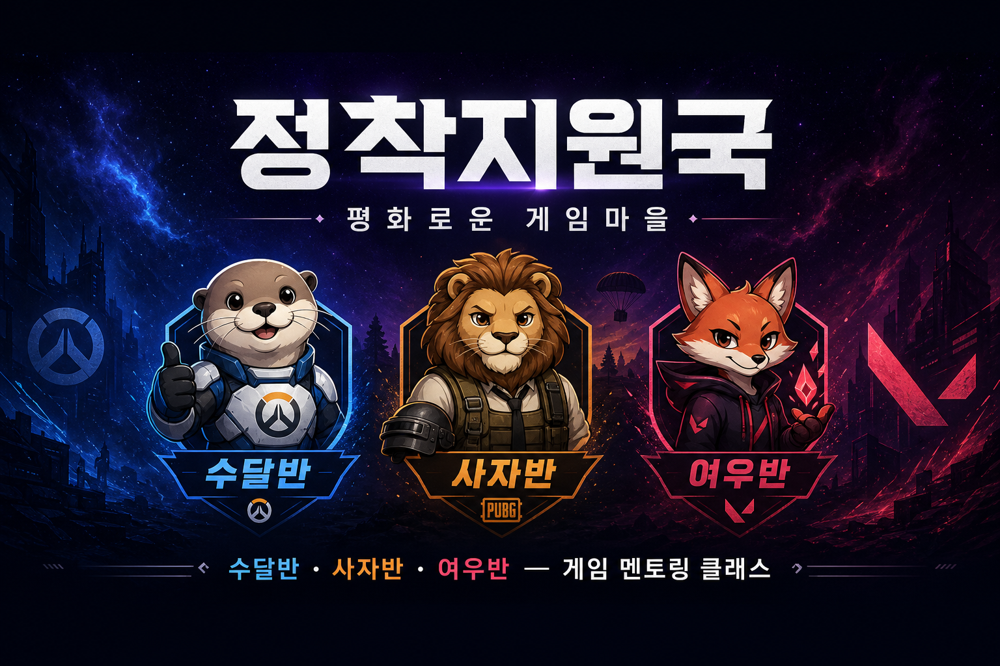
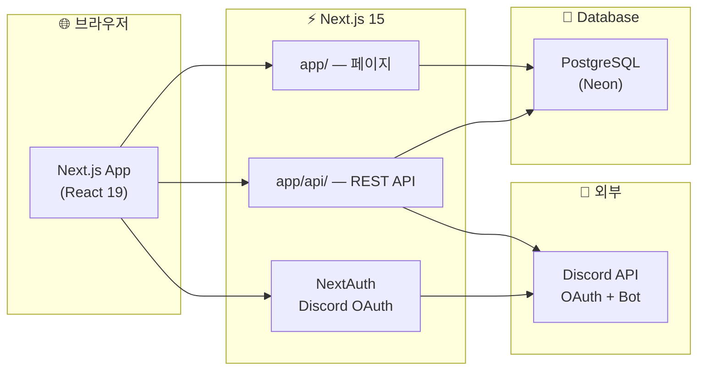

<div align="center">



# 🎮 정착지원국

**게임 멘토링 클래스 · 수강 신청 · 선생님 관리 · 졸업면담**을 한곳에서!

> 수달반 🦦 · 사자반 🦁 · 여우반 🦊 — 함께 성장하는 게임 클래스

<br/>

[](https://nextjs.org/)
[](https://react.dev/)
[](https://www.typescriptlang.org/)
[](https://tailwindcss.com/)
[](https://www.prisma.io/)
[](https://neon.tech/)
[](https://discord.com/developers)

<br/>


<br/>

**🌍 프로덕션:** [ow-school.vercel.app](https://ow-school.vercel.app)

</div>

---

## 📖 이 프로젝트는?

**정착지원국**(평화로운 게임마을)은 게임 멘토링 프로그램을 위한 **풀스택 웹 애플리케이션**입니다.

Next.js App Router 하나로 프론트·API·인증을 모두 처리하고, **Discord OAuth**로 로그인하며 **PostgreSQL(Neon)** 에 데이터를 저장합니다.

| 👤 대상 | 🛠️ 할 수 있는 것 |
|--------|------------------|
| **일반 유저** | 반별 선생님 둘러보기 · 수강 신청 · 마이페이지 · 서버 닉 변경 · 졸업면담 작성 |
| **선생님** | 담당 학생 목록 · 학생 상세 · 통계 대시보드 |
| **관리자** | 대시보드 · 학생/선생님 CRUD · 신청 승인 · 졸업면담 · 포인트 · Discord 동기화 |

다크 테마 UI 🌌 + 모바일 반응형 📱 + Discord 서버 연동 🔗까지 갖춘, **실제 운영을 염두에 둔** 프로젝트예요.

---

## ✨ 주요 기능

### 🌟 사용자 페이지

| 기능 | 경로 | 설명 |
|------|------|------|
| 🏠 **메인** | `/` | Hero, 클래스 소개, 공지사항 (ISR 60초) |
| 📚 **반별 페이지** | `/classes/[slug]` | 선생님 목록 · 모집 상태 · **실시간 인원** |
| 👨‍🏫 **선생님 상세** | `/teachers/[id]` | 프로필 · MBTI · **담당 학생 표** · 신청 버튼 |
| 📝 **수강 신청** | `/apply` | 닉네임 · 디스코드 · 플레이 시간 · 담당 선생님 선택 |
| 💬 **졸업면담** | `/interview` | 졸업생 인터뷰 제출 · 포인트 자동 지급 |
| 👤 **마이페이지** | `/mypage` | 서버 닉·역할 · 신청/면담 내역 · 닉네임 변경 |

### 👨‍🏫 선생님 페이지

| 기능 | 경로 | 설명 |
|------|------|------|
| 📊 **선생님 대시보드** | `/teacher` | 담당 학생 수 · 월별 통계 |
| 📋 **학생 관리** | `/teacher/students` | 담당 학생 목록 · 상세 조회 |

### 🔐 관리자 페이지 (`/admin`)

> **Discord 로그인** + `AdminRole` 권한 필요 (비밀번호 게이트 없음)

| 메뉴 | URL | 하이라이트 |
|------|-----|-----------|
| 📊 **대시보드** | `/admin` | 월별 차트 · 반별 통계 · **Discord 동기화** |
| 👥 **학생 관리** | `/admin/students` | 서버 닉·역할 · 담당 선생님 · 닉 수정 |
| 🎓 **졸업생** | `/admin/graduated` | 졸업 처리된 학생 목록 |
| 👨‍🏫 **선생님 관리** | `/admin/teachers` | 등록/수정 · 정원 설정 |
| 📋 **신청 관리** | `/admin/applications` | 승인/거절 · 토스트 알림 |
| 💬 **졸업면담** | `/admin/interviews` | 조회 · 삭제 (감사 로그) |
| 💰 **포인트 관리** | `/admin/points` | 월별 표 · 엑셀 다운로드 |
| ⭐ **졸업후기** | `/admin/graduation-reviews` | 졸업후기 CRUD |
| 🛡️ **관리자 목록** | `/admin/admins` · `/admin/roles` | 관리자 권한 부여 |

### 🔗 Discord 연동 핵심

| 항목 | 방식 |
|------|------|
| **사용자 식별** | `discordId` (Discord User ID) — 닉네임 아님 |
| **학생↔선생님** | `teacherId` (User.teacherId) |
| **화면 표시** | 서버 닉 → 글로벌 표시 이름 → 유저네임 |
| **닉 변경** | 마이페이지에서 변경해도 연결·포인트·면담 유지 |
| **관리자 동기화** | 서버 닉·역할 최신화 · 학생 수 재계산 · 연결 검증 |

---

## 🧰 사용 기술 (Tech Stack)

### 🖥️ 프론트엔드 · 백엔드 — Next.js 풀스택

| 분류 | 기술 | 버전 / 비고 |
|------|------|------------|
| **프레임워크** | **Next.js** | ^15.2 — App Router, SSR/ISR, API Routes |
| **언어** | TypeScript | ^5.5 |
| **UI** | **React** | ^19 — Server & Client Components |
| **스타일** | Tailwind CSS | ^3.4 — 다크 테마 고정 |
| **UI 컴포넌트** | Radix UI + CVA | Dialog, Select, Label … |
| **아이콘** | Lucide React | ^0.462 |
| **토스트** | Sonner | ^1.7 |
| **검증** | Zod | ^3.23 |
| **엑셀** | xlsx | 관리자 포인트 다운로드 |

### 🔐 인증 · 외부 연동

| 분류 | 기술 | 비고 |
|------|------|------|
| **인증** | NextAuth.js v5 | Discord OAuth2 |
| **Discord Bot** | REST API v10 | 서버 닉·역할 동기화, 닉 변경 |
| **OAuth 스코프** | `identify`, `guilds`, `guilds.members.read` | |

### 💾 데이터베이스

| 분류 | 기술 | 비고 |
|------|------|------|
| **ORM** | Prisma | ^6.5 |
| **DB** | PostgreSQL | Neon (Vercel 배포 권장) |
| **마이그레이션** | `prisma migrate` / `db push` | 빌드 시 자동 push |
| **시드** | `prisma/seed.ts` | 반·선생님 목 데이터 |

### 🛠️ 개발 · 운영 도구

| 도구 | 용도 |
|------|------|
| **npm** | 의존성 · 스크립트 |
| **Vercel** | 프로덕션 배포 |
| **Neon** | 서버리스 PostgreSQL |
| **sharp** | 이미지 WebP 최적화 |
| **Git** | 버전 관리 |

---

## 🏗️ 아키텍처



```
peaceful_game/
├── 📦 package.json
├── 📜 README.md                 ← 지금 보고 있는 문서!
├── 🔧 scripts/
│   ├── vercel-build.mjs         ← 빌드 시 db push + seed
│   └── optimize-images.mjs      ← WebP 변환
├── 🗄️ prisma/
│   ├── schema.prisma            ← User, Teacher, Interview, PointHistory …
│   ├── seed.ts
│   └── migrations/
├── 🖼️ public/images/            ← 로고, 배너, 마스코트 (WebP)
└── src/
    ├── app/                     ← 페이지 · API Routes
    │   ├── page.tsx             ← 홈
    │   ├── classes/[slug]/      ← 반별
    │   ├── teachers/            ← 선생님 목록·상세
    │   ├── apply/               ← 수강 신청
    │   ├── interview/           ← 졸업면담
    │   ├── mypage/              ← 마이페이지
    │   ├── teacher/             ← 선생님 전용
    │   ├── admin/               ← 관리자
    │   └── api/                 ← REST API
    ├── components/              ← layout, ui, admin, pages
    ├── lib/                     ← auth, prisma, discord-guild, points …
    └── types/                   ← 공유 타입
```

---

## 🚀 빠른 시작

### 사전 준비

| 프로그램 | 버전 | 설치 확인 |
|---------|------|----------|
| **Node.js** | 18+ | `node -v` |
| **npm** | 9+ | `npm -v` |
| **PostgreSQL** | — | [Neon](https://neon.tech) 무료 티어 권장 |
| **Discord App** | — | [Developer Portal](https://discord.com/developers/applications) |
| **Git** | 아무거나 | `git --version` |

### 1️⃣ 클론 & 의존성 설치

```bash
git clone <your-repo-url> peaceful_game
cd peaceful_game
npm install
```

### 2️⃣ 환경 변수

```bash
cp .env.example .env
```

| 변수 | 필수 | 설명 |
|------|:----:|------|
| `DATABASE_URL` | ✅ | PostgreSQL 연결 (`postgresql://...`) |
| `AUTH_SECRET` | ✅ | `openssl rand -base64 32` 로 생성 |
| `NEXTAUTH_URL` | ✅ | `http://localhost:3000` |
| `DISCORD_CLIENT_ID` | ✅ | Discord OAuth 앱 ID |
| `DISCORD_CLIENT_SECRET` | ✅ | Discord OAuth 시크릿 |
| `DISCORD_GUILD_ID` | ⭐ | 디스코드 서버 ID (가입 확인·닉·역할) |
| `DISCORD_BOT_TOKEN` | ⭐ | 봇 토큰 (닉 변경·동기화) |

> ⭐ `DISCORD_GUILD_ID` / `DISCORD_BOT_TOKEN` 없으면 일반 로그인만 동작합니다.

**Discord Redirect URI:**

- 로컬: `http://localhost:3000/api/auth/callback/discord`
- 프로덕션: `https://ow-school.vercel.app/api/auth/callback/discord`

### 3️⃣ DB 초기화

```bash
npm run db:setup
```

`db push` + `seed` — 반·선생님 목 데이터가 자동 생성됩니다.

### 4️⃣ 개발 서버 실행

```bash
npm run dev
```

| 서비스 | 주소 | 설명 |
|--------|------|------|
| 🖥️ 앱 | http://localhost:3000 | Next.js |
| ❤️ 헬스체크 | http://localhost:3000/api/health | 서버 상태 |

---

## 📜 npm 스크립트 치트시트

| 명령 | 설명 |
|------|------|
| `npm run dev` | 🚀 개발 서버 (`:3000`) |
| `npm run build` | 프로덕션 빌드 (Prisma generate → db push → seed → next build) |
| `npm run start` | 빌드 결과 실행 |
| `npm run lint` | TypeScript 검사 (`tsc --noEmit`) |
| `npm run db:push` | Prisma 스키마 → DB 반영 |
| `npm run db:seed` | 시드 데이터 삽입 |
| `npm run db:setup` | `db:push` + `db:seed` |
| `npm run images:optimize` | 이미지 WebP 변환 |

---

## 🌍 Vercel 배포

1. [Neon](https://neon.tech)에서 프로젝트 생성 → **Pooled** 연결 문자열 복사
2. Vercel → **Settings → Environment Variables** (따옴표 없이 Value만):

| 변수 | Production 값 |
|------|--------------|
| `DATABASE_URL` | `postgresql://...@ep-xxx-pooler....neon.tech/neondb?sslmode=require` |
| `AUTH_SECRET` | 랜덤 시크릿 |
| `DISCORD_CLIENT_ID` | Discord 앱 ID |
| `DISCORD_CLIENT_SECRET` | Discord 시크릿 |
| `DISCORD_GUILD_ID` | 서버 ID |
| `DISCORD_BOT_TOKEN` | 봇 토큰 |
| `NEXTAUTH_URL` | `https://ow-school.vercel.app` |

3. **Redeploy** — 빌드 시 `db push` + `seed` 자동 실행
4. 배포 후 관리자 페이지에서 **「Discord 동기화」** 1회 실행 권장

> ⚠️ `DATABASE_URL`은 반드시 `postgresql://`로 시작해야 합니다.

---

## 🔌 Discord 서버 연동

### 봇 설정

1. Developer Portal → **Bot** → Token → `DISCORD_BOT_TOKEN`
2. **Server Members Intent** 활성화
3. 봇 권한: **닉네임 관리(MANAGE_NICKNAMES)** 포함해 서버 초대

```
https://discord.com/api/oauth2/authorize?client_id=CLIENT_ID&permissions=134217728&scope=bot
```

### 동작 요약

- 로그인 시 **서버 미가입**이면 로그인 거부 (Guild ID 설정 시)
- 마이페이지: **서버 닉·역할** 표시 및 **닉네임 변경**
- 관리자: **Discord 동기화** — 전체 유저 닉·역할 갱신 + 학생 수 재계산
- 사용자 식별은 **Discord User ID** 기준 (닉 변경해도 데이터 유지)

---

## 💰 포인트 시스템

| 유형 | 포인트 | 조건 |
|------|--------|------|
| 🎓 졸업면담 | 15,000P | 졸업면담 최초 제출 |
| 🎪 동호회 가입 | 5,000P | 면담에서 동호회 가입 선택 |

- `PointHistory`에 `userId` 기준 저장 → 닉 변경해도 유지
- 관리자 `/admin/points`에서 월별 조회 · 엑셀 다운로드

---

## 🦦🦁🦊 반(클래스) 안내

| 반 | 마스코트 | 게임 | slug |
|----|---------|------|------|
| 🦦 **수달반** | 수달 | **Overwatch** (오버워치) | `overwatch` |
| 🦁 **사자반** | 사자 | **PUBG** (배틀그라운드) | `pubg` |
| 🦊 **여우반** | 여우 | **Valorant** (발로란트) | `valorant` |

---

## 🛡️ 기본 관리자

최초 Discord 로그인 시 아래 Username은 자동으로 관리자 권한이 부여됩니다.

`sweet__rain` · `alpha_rein.` · `hanbyeol2497` · `pastel_purete` · `teamgod804` · `antares_s` · `minozizi` · `sperospera1`

(전체 목록: `src/lib/constants.ts` → `DEFAULT_ADMIN_USERNAMES`)

---

## 🎨 UI / UX 하이라이트

- 🌌 **다크 테마 고정** — 우주풍 그라데이션 · 보라 포인트 컬러
- 📱 **모바일 반응형** — Sheet 메뉴, `page-container`, 반별 카드
- 🔔 **토스트 알림** — Sonner — 신청·닉 변경·저장 피드백
- 🖼️ **WebP 이미지** — 배너·마스코트 최적화
- ⚡ **ISR 캐싱** — 홈 클래스 통계 60초 revalidate
- 🔗 **Discord 실시간 연동** — 서버 닉·역할 · 관리자 일괄 동기화

---

## 🩹 트러블슈팅

| 😵 증상 | 💊 해결 |
|--------|--------|
| 로그인 실패 / 서버 미가입 | Discord 서버 가입 여부 확인 · `DISCORD_GUILD_ID` 설정 |
| 닉 변경 후 데이터 끊김 | 관리자 **Discord 동기화** 실행 · `discordId` 기준 연결 확인 |
| 선생님 카드·상세 인원 불일치 | 동기화 버튼으로 `currentStudents` 재계산 |
| `prisma generate` EPERM (Windows) | node 프로세스 종료 후 재시도 |
| `DATABASE_URL` 오류 | `postgresql://` 접두사 · 따옴표 제거 · Neon Pooled URL 사용 |
| 빌드 시 DB 연결 실패 | Vercel 환경 변수에 `DATABASE_URL` 설정 후 Redeploy |
| 봇 닉 변경 403 | 봇 역할이 대상 유저보다 위에 있는지 · MANAGE_NICKNAMES 권한 확인 |

---

## 📚 주요 API 엔드포인트

| 메서드 | 경로 | 설명 |
|--------|------|------|
| `GET` | `/api/health` | 헬스체크 |
| `GET` | `/api/me` | 내 프로필 (닉·역할·신청·면담) |
| `PATCH` | `/api/me/guild-nick` | 서버 닉네임 변경 |
| `POST` | `/api/applications` | 수강 신청 |
| `POST` | `/api/interviews` | 졸업면담 제출 |
| `GET` | `/api/teacher/students` | 선생님 — 담당 학생 목록 |
| `POST` | `/api/admin/discord-sync` | 관리자 — Discord 일괄 동기화 |
| `GET` | `/api/admin/points` | 관리자 — 포인트 월별 조회 |

---

| 문서 | 내용 |
|------|------|
| [로드맵 & TODO](docs/ROADMAP.md) | 앞으로 해야 할 것 · 추천 목록 · 배포 체크리스트 |

버그 제보 · 기능 제안은 Issue / PR 환영합니다! 🎉

---

<div align="center">

**Made with 💙 Next.js · React · TypeScript · Prisma · Discord**

🦦 수달반 · 🦁 사자반 · 🦊 여우반 — **정착지원국**과 함께 게임 실력 UP!

[ow-school.vercel.app](https://ow-school.vercel.app)

</div>
