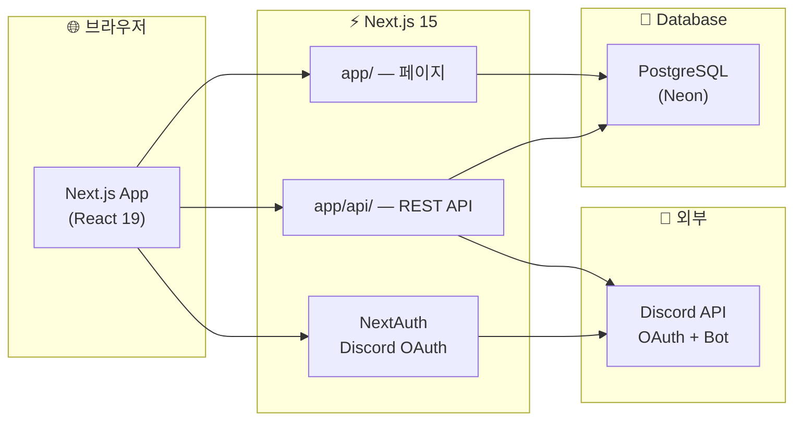

<div align="center">


# 🎮 정착지원국

**평화로운 게임마을** — 게임 멘토링 클래스 · 수강 신청 · 선생님 관리 · 졸업면담

> 수달반 🦦 · 사자반 🦁 · 여우반 🦊 — 함께 성장하는 게임 클래스

<br/>

[](https://nextjs.org/)
[](https://react.dev/)
[](https://www.typescriptlang.org/)
[](https://tailwindcss.com/)
[](https://www.prisma.io/)
[](https://neon.tech/)
[](https://discord.com/developers)

<br/>

**🌍 프로덕션:** [ow-school.vercel.app](https://ow-school.vercel.app) · **📦 저장소:** [github.com/zyansuh/ow_school](https://github.com/zyansuh/ow_school)

</div>

---

## 📖 이 프로젝트는?

**정착지원국**(평화로운 게임마을)은 Discord 커뮤니티 기반 **게임 멘토링 프로그램**을 운영하기 위한 풀스택 웹 애플리케이션입니다.

Next.js App Router 하나로 프론트·API·인증을 처리하고, **Discord OAuth**로 로그인하며 **PostgreSQL(Neon)** 에 데이터를 저장합니다.

| 👤 대상 | 🛠️ 할 수 있는 것 |
|--------|------------------|
| **마을주민 · 학생** | 반별 담당 선생님 둘러보기 · 수강 신청 · 마이페이지 · 서버 닉 변경 · 졸업면담 |
| **선생님** | 담당 학생 목록 · 학생 상세 · 통계 대시보드 |
| **관리자** | 사이트 역할 지정 · 학생/선생님 CRUD · 졸업·졸업 취소 · Discord 동기화 · 포인트 관리 |

다크 테마 UI · 모바일 반응형 · Discord 서버 연동까지 갖춘 **실제 운영**을 염두에 둔 프로젝트입니다.

---

## 👥 사이트 이용자 역할

관리자는 `/admin/users`에서 역할을 **수동 지정**할 수 있고, 미지정 시 아래 규칙으로 **자동 분류**됩니다.

| 역할 | 값 | 자동 분류 기준 |
|------|-----|----------------|
| **관리자** | `admin` | `AdminRole` 보유 |
| **선생님** | `teacher` | Discord `신입반교사` 역할 · `Teacher.discordUserId` 연결 · Teacher 닉 매칭 |
| **학생** | `student` | 디스코드 **서버 가입 2달 미만** 회원 |
| **마을주민** | `resident` | 서버 가입 2달 이상 · 서버 미가입 · 그 외 일반 회원 |

- 수동 지정(`User.siteRole`)이 있으면 자동 규칙보다 **우선**합니다.
- **「자동 (추론)」** 선택 시 `siteRole`을 비워 기존 규칙으로 되돌립니다.
- 서버 가입일은 Discord `joined_at` → `User.guildJoinedAt`에 저장됩니다. 미동기화 시 **최초 로그인일**을 보조 기준으로 사용합니다.
- **학생 관리** 목록·통계는 `student` 역할만 포함합니다 (마을주민 제외).

관련 코드: `src/lib/users/role.ts`, `src/lib/discord/guild-tenure.ts`

```bash
# 역할 분류 순수 함수 검증 (DB 불필요)
node scripts/verify-user-role.mjs
```

---

## ✨ 주요 기능

### 🌟 사용자 페이지

| 기능 | 경로 | 설명 |
|------|------|------|
| 🏠 **메인** | `/` | Hero · 반(클래스) 소개 · 담당 선생님 안내 · 공지 (ISR 60초) |
| 📚 **반별 페이지** | `/classes/[slug]` | 해당 반 담당 선생님 · `TeacherCard` · 수강 신청 링크 |
| 👨‍🏫 **선생님** | `/teachers` → `/#classes` | 선생님 목록은 메인 반 섹션으로 안내 |
| 👨‍🏫 **선생님 상세** | `/teachers/[id]` | 프로필 · MBTI · 담당 학생 · 신청 버튼 |
| 📝 **수강 신청** | `/apply` | 닉네임 · 디스코드 · 플레이 시간 · 담당 선생님 선택 |
| 💬 **졸업면담** | `/interview` | 졸업면담 제출 · 포인트 자동 지급 |
| 👤 **마이페이지** | `/mypage` | 서버 닉·역할 · 신청/면담 내역 · 닉 변경 · Discord 새로고침 |

### 👨‍🏫 선생님 페이지

| 기능 | 경로 | 설명 |
|------|------|------|
| 📊 **선생님 대시보드** | `/teacher` | 담당 학생 수 · 월별 통계 |
| 📋 **학생 관리** | `/teacher/students` | 담당 학생 목록 · 졸업 여부 · 면담 요약 |

### 🔐 관리자 페이지 (`/admin`)

> **Discord 로그인** + `AdminRole` 권한 필요

| 메뉴 | URL | 하이라이트 |
|------|-----|-----------|
| 📊 **대시보드** | `/admin` | 월별 차트 · 반별 통계 · Discord 동기화 요약 |
| 🔗 **Discord 동기화** | `/admin/discord-sync` | 일괄 동기화 · 불일치 상세 · 연결 검증 |
| 👤 **사이트 사용자** | `/admin/users` | 전체 로그인 계정 · **역할 지정** · **표시 닉네임** · **졸업/졸업 취소** · 서버 가입일 |
| 👥 **학생 관리** | `/admin/students` | 담당 선생님 변경 · 졸업 처리 |
| 🎓 **졸업생** | `/admin/graduated` | 졸업생 목록 · **졸업 취소(재학 복구)** |
| 👨‍🏫 **선생님 관리** | `/admin/teachers` | 등록/수정/삭제 · 활동/비활성 · 정원 · 담당 반 복수 선택 |
| 📋 **신청 관리** | `/admin/applications` | 수강 신청 내역 |
| 💬 **졸업면담** | `/admin/interviews` | 조회 · 삭제 (감사 로그) |
| 💰 **포인트 관리** | `/admin/points` | 월별 표 · 엑셀 다운로드 |
| ⭐ **졸업후기** | `/admin/graduation-reviews` | 졸업후기 조회 |
| 🛡️ **관리자 목록** | `/admin/admins` | 관리자 권한 부여·해제 |
| 📨 **권한 요청** | `/admin/roles` | 관리자 권한 요청 승인·거절 |

### 🎓 졸업 · 졸업 취소

| 동작 | 처리 내용 |
|------|----------|
| **졸업** | `status` → `graduated` · 반·담당 선생님 배정 해제 · 선생님 인원 수 갱신 |
| **졸업 취소** | `status` → `active` · 마지막 담당 선생님·반 복원 (면담·신청 이력 기준) |

졸업 취소는 다음에서 가능합니다.

- `/admin/graduated` — 졸업생 전용 목록
- `/admin/users` — 사이트 사용자 **졸업 관리** 열
- `/admin/students` — 졸업 취소 API 지원 (역할과 무관하게 `status` 기준)

### 🔗 Discord 연동 핵심

| 항목 | 방식 |
|------|------|
| **사용자 식별** | `discordId` (Discord User ID) — 닉 변경해도 데이터 유지 |
| **학생↔선생님** | `User.teacherId` |
| **화면 표시 (일반)** | 서버 닉 → 글로벌 표시 이름 → 유저네임 |
| **화면 표시 (관리자)** | `displayNickname` → 서버 닉 → 글로벌 → 유저네임 |
| **서버 가입일** | Discord Member `joined_at` → `guildJoinedAt` |
| **관리자 동기화** | 서버 닉·역할·가입일 갱신 · 학생 수 재계산 · 선생님 연결 검증 |
| **성능** | `/api/me` DB 즉시 반환 + stale 시 백그라운드 sync |

---

## 🧰 사용 기술 (Tech Stack)

| 분류 | 기술 | 비고 |
|------|------|------|
| **프레임워크** | Next.js 15 | App Router, SSR/ISR, API Routes |
| **언어** | TypeScript 5.5 | `npm run lint` = `tsc --noEmit` |
| **UI** | React 19 | Server & Client Components |
| **스타일** | Tailwind CSS 3.4 | 다크 테마 고정 |
| **UI 컴포넌트** | Radix UI + CVA | Dialog, Select, Label … |
| **인증** | NextAuth.js v5 | Discord OAuth2 |
| **ORM** | Prisma 6.5 | PostgreSQL (Neon) |
| **검증** | Zod | API 입력 검증 |
| **토스트** | Sonner | 사용자 피드백 |
| **엑셀** | xlsx | 관리자 포인트 다운로드 |
| **이미지** | sharp | WebP 최적화 |
| **배포** | Vercel | Cron: 매일 Discord 동기화 |

---

## 🏗️ 아키텍처



### 디렉터리 구조

```
peaceful_game/
├── package.json
├── README.md
├── vercel.json                  # Cron: /api/cron/discord-sync
├── scripts/
│   ├── vercel-build.mjs         # migrate deploy + next build
│   ├── verify-user-role.mjs     # 역할 분류 검증
│   └── optimize-images.mjs
├── prisma/
│   ├── schema.prisma
│   ├── seed.ts
│   └── migrations/
├── public/images/               # 로고, 배너, 마스코트
├── docs/
│   ├── ROADMAP.md
│   └── assets/
└── src/
    ├── app/                     # 페이지 · API Routes (라우팅은 유지)
    ├── components/
    │   ├── ui/                  # 공통 UI 프리미티브
    │   ├── layout/              # 헤더·푸터·레이아웃
    │   ├── admin/               # 관리자 전용 컴포넌트
    │   ├── teacher/             # 선생님 UI
    │   ├── home/                # 홈 콘텐츠
    │   ├── apply/ · cards/ · interview/
    ├── hooks/
    │   ├── auth/                # Discord 로그인 훅
    │   ├── admin/ · apply/ · mypage/
    ├── lib/
    │   ├── auth/                # NextAuth 설정 · rbac
    │   ├── admin/               # 관리자·Discord 동기화·포인트
    │   ├── discord/             # Guild API · 가입일·멤버십
    │   ├── teacher/             # 선생님 CRUD · 학생·모집
    │   ├── students/            # 학생 목록 · 배정 · 졸업
    │   ├── users/               # 역할 · 표시명
    │   ├── home/                # 홈 통계 · 반 시드
    │   ├── interviews/          # 면담 접근·유틸
    │   ├── applications/        # 수강 신청 서비스
    │   ├── utils/               # cn · formatDate · segment …
    │   ├── prisma.ts · api-helpers.ts · constants.ts
    ├── styles/
    │   ├── design-system.ts     # `ds` 디자인 토큰
    │   └── admin/               # 관리자 레거시 스타일
```

### 주요 `lib` 모듈

| 경로 | 역할 |
|------|------|
| `users/role.ts` | 사이트 역할 (admin / teacher / student / resident) |
| `discord/guild-tenure.ts` | 서버 가입 2달 기준 학생 판별 |
| `discord/guild.ts` | Discord Bot API · 닉·역할·가입일 동기화 |
| `students/graduation.ts` | 졸업 · 졸업 취소 · 담당 복원 |
| `students/users.ts` | 학생 목록 조회 |
| `students/assignment.ts` | 담당 선생님 배정 |
| `auth/rbac.ts` | 관리자 권한 · 기본 관리자 부여 |
| `teacher/` | 선생님 엔티티 · 모집 · 담당 학생 |
| `admin/discord-sync.ts` | 관리자 Discord 일괄 동기화 |

---

## 🚀 빠른 시작

### 사전 준비

| 프로그램 | 버전 | 확인 |
|---------|------|------|
| **Node.js** | 18+ | `node -v` |
| **npm** | 9+ | `npm -v` |
| **PostgreSQL** | — | [Neon](https://neon.tech) 권장 |
| **Discord App** | — | [Developer Portal](https://discord.com/developers/applications) |

### 1️⃣ 클론 & 설치

```bash
git clone https://github.com/zyansuh/ow_school.git peaceful_game
cd peaceful_game
npm install
```

### 2️⃣ 환경 변수

```bash
cp .env.example .env
```

| 변수 | 필수 | 설명 |
|------|:----:|------|
| `DATABASE_URL` | ✅ | Neon **Pooled** 연결 (`postgresql://...pooler...`) |
| `DIRECT_URL` | ⭐ | Neon **Direct** 연결 — `migrate deploy`용 (Vercel 권장) |
| `AUTH_SECRET` | ✅ | `openssl rand -base64 32` |
| `NEXTAUTH_URL` | ✅ | 로컬: `http://localhost:3000` |
| `DISCORD_CLIENT_ID` | ✅ | Discord OAuth 앱 ID |
| `DISCORD_CLIENT_SECRET` | ✅ | OAuth 시크릿 |
| `DISCORD_GUILD_ID` | ⭐ | 디스코드 서버 ID |
| `DISCORD_BOT_TOKEN` | ⭐ | 봇 토큰 (닉 변경·동기화) |
| `GUILD_SYNC_TTL_SEC` | — | Guild 캐시 TTL(초). 기본 300 |
| `DEFAULT_ADMIN_DISCORD_IDS` | — | 쉼표 구분 Discord ID — 기본 관리자 |
| `DISCORD_WEBHOOK_URL` | — | 면담·관리자 알림 |
| `CRON_SECRET` | — | Vercel Cron 인증 |
| `RUN_DB_SEED` | — | Vercel 빌드 시 seed 실행 (`true`일 때만) |

> ⭐ Guild/Bot 미설정 시 일반 Discord 로그인만 동작합니다.

**Discord Redirect URI**

- 로컬: `http://localhost:3000/api/auth/callback/discord`
- 프로덕션: `https://ow-school.vercel.app/api/auth/callback/discord`

### 3️⃣ DB 초기화 (로컬·최초 1회)

```bash
# 스키마 반영 + 시드 (반·선생님 목 데이터)
npm run db:setup
```

프로덕션 DB에 **이미 운영 데이터가 있는 경우** seed는 실행하지 마세요. Vercel에서는 `RUN_DB_SEED=true`를 설정하지 않는 것이 기본입니다.

```bash
# 마이그레이션만 적용 (운영 DB)
npx prisma migrate deploy
```

### 4️⃣ 개발 서버

```bash
npm run dev
```

| 서비스 | 주소 |
|--------|------|
| 앱 | http://localhost:3000 |
| 헬스체크 | http://localhost:3000/api/health |

---

## 📜 npm 스크립트

| 명령 | 설명 |
|------|------|
| `npm run dev` | 개발 서버 (`:3000`) |
| `npm run build` | Prisma generate → migrate deploy → next build |
| `npm run start` | 프로덕션 서버 |
| `npm run lint` | TypeScript 검사 |
| `npm run db:push` | 스키마 → DB (`prisma db push`) |
| `npm run db:seed` | 시드 데이터 |
| `npm run db:setup` | `db:push` + `db:seed` |
| `npm run images:optimize` | 이미지 WebP 변환 |

---

## 🌍 Vercel 배포

1. [Neon](https://neon.tech) 프로젝트 생성
2. **Pooled** URL → `DATABASE_URL`
3. **Direct** URL → `DIRECT_URL` (마이그레이션 안정성)
4. Vercel Environment Variables 설정 (따옴표 없이)

| 변수 | Production 예시 |
|------|----------------|
| `DATABASE_URL` | `postgresql://...@ep-xxx-pooler....neon.tech/neondb?sslmode=require` |
| `DIRECT_URL` | `postgresql://...@ep-xxx....neon.tech/neondb?sslmode=require` |
| `AUTH_SECRET` | 랜덤 시크릿 |
| `DISCORD_*` | OAuth + Guild + Bot |
| `NEXTAUTH_URL` | `https://ow-school.vercel.app` |

5. **Redeploy** — 빌드 시 `prisma migrate deploy` 자동 실행
6. 배포 후 `/admin/discord-sync`에서 **Discord 동기화 1회** 권장 (가입일·닉·역할 반영)

> ⚠️ 운영 DB: `RUN_DB_SEED`는 기본 **미설정**. 시드는 로컬·초기 환경에만 사용하세요.

---

## 🔌 Discord 서버 연동

### 봇 설정

1. Developer Portal → **Bot** → Token → `DISCORD_BOT_TOKEN`
2. **Server Members Intent** 활성화
3. 봇 권한: **닉네임 관리(MANAGE_NICKNAMES)** 포함해 서버 초대

```
https://discord.com/api/oauth2/authorize?client_id=CLIENT_ID&permissions=134217728&scope=bot
```

### OAuth 스코프

`identify` · `guilds` · `guilds.members.read`

### 운영 팁

- 로그인 시 서버 미가입이면 로그인 거부 (Guild ID 설정 시)
- 마이페이지: 서버 닉·역할 표시 및 닉네임 변경
- 관리자 **Discord 동기화**: 전체 유저 닉·역할·**가입일** 갱신 + 학생 수 재계산
- Vercel Cron: 매일 04:00 UTC 자동 동기화 (`vercel.json`)
- 선생님 **비활성** → 신규 수강 신청 대상에서 제외
- 학생 **담당 선생님 변경** → `/admin/students`

---

## 💰 포인트 시스템

| 유형 | 포인트 | 조건 |
|------|--------|------|
| 🎓 졸업면담 | 15,000P | 졸업면담 최초 제출 |
| 🎪 동호회 가입 | 5,000P | 면담에서 동호회 가입 선택 |

- `PointHistory`에 `userId` 기준 저장 → 닉 변경해도 유지
- `/admin/points`에서 월별 조회 · 엑셀 다운로드

---

## 🦦🦁🦊 반(클래스) 안내

| 반 | 마스코트 | 게임 | slug |
|----|---------|------|------|
| 🦦 **수달반** | 수달 | Overwatch (오버워치) | `overwatch` |
| 🦁 **사자반** | 사자 | PUBG (배틀그라운드) | `pubg` |
| 🦊 **여우반** | 여우 | Valorant (발로란트) | `valorant` |

---

## 🛡️ 기본 관리자

최초 Discord 로그인 시 아래 **Username** 또는 `DEFAULT_ADMIN_DISCORD_IDS`에 등록된 ID는 자동으로 관리자 권한이 부여됩니다.

`sweet__rain` · `alpha_rein.` · `hanbyeol2497` · `pastel_purete` · `teamgod804` · `antares_s` · `minozizi` · `sperospera1`

(전체: `src/lib/constants.ts` → `DEFAULT_ADMIN_USERNAMES`)

---

## 📚 주요 API 엔드포인트

### 공개 · 로그인 사용자

| 메서드 | 경로 | 설명 |
|--------|------|------|
| `GET` | `/api/health` | 헬스체크 |
| `GET` | `/api/me` | 내 프로필 (`?refresh=1` 강제 동기화) |
| `PATCH` | `/api/me/guild-nick` | 서버 닉네임 변경 |
| `POST` | `/api/applications` | 수강 신청 |
| `POST` | `/api/interviews` | 졸업면담 제출 |
| `GET` | `/api/classes` | 반 목록 (없으면 자동 생성) |
| `GET` | `/api/teachers` | 선생님 목록 |

### 선생님

| 메서드 | 경로 | 설명 |
|--------|------|------|
| `GET` | `/api/teacher/students` | 담당 학생 목록 |
| `GET` | `/api/teacher/stats` | 통계 |

### 관리자

| 메서드 | 경로 | 설명 |
|--------|------|------|
| `GET` | `/api/admin/site-users` | 전체 사이트 사용자 |
| `PATCH` | `/api/admin/site-users/[id]` | 표시 닉 · **siteRole** · **졸업/졸업취소** |
| `PATCH` | `/api/admin/students/[id]` | 졸업 · 졸업 취소 · 담당 선생님 · 표시 닉 |
| `GET` | `/api/admin/graduated` | 졸업생 목록 |
| `POST` | `/api/admin/discord-sync` | Discord 일괄 동기화 |
| `GET` | `/api/admin/ops-status` | 스키마·연동 상태 |
| `GET` | `/api/admin/points` | 포인트 월별 조회 |
| `GET` | `/api/admin/roles` | 관리자 권한 · 요청 목록 |

---

## 🗄️ 데이터 모델 요약

| 모델 | 설명 |
|------|------|
| `User` | Discord 계정 · `siteRole` · `displayNickname` · `guildJoinedAt` · `status` |
| `Class` | 반 (수달/사자/여우) |
| `Teacher` | 선생님 · `discordUserId` · 복수 반 (`TeacherClass`) |
| `Application` | 수강 신청 |
| `Interview` | 졸업면담 |
| `PointHistory` | 포인트 지급 이력 |
| `AdminRole` | 관리자 권한 |
| `AdminRoleRequest` | 관리자 권한 요청 |
| `GraduationReview` | 졸업후기 |

---

## 🩹 트러블슈팅

| 증상 | 해결 |
|------|------|
| 로그인 실패 / Configuration | `AUTH_SECRET` · `DISCORD_CLIENT_*` · DB 연결 확인 |
| 서버 미가입 로그인 거부 | Discord 서버 가입 · `DISCORD_GUILD_ID` 확인 |
| P1002 migrate timeout | Vercel에 `DIRECT_URL` 설정 후 `npx prisma migrate deploy` |
| P3009 failed migration | `prisma migrate resolve` 후 재배포 (운영 데이터 백업 권장) |
| 역할·가입일이 안 맞음 | `/admin/discord-sync` 실행 |
| 졸업 취소 안 됨 | `/admin/users` 또는 `/admin/graduated` 사용 · `status=graduated` 확인 |
| 선생님 인원 불일치 | Discord 동기화로 `currentStudents` 재계산 |
| 봇 닉 변경 403 | 봇 역할 순위 · MANAGE_NICKNAMES 권한 |
| `prisma generate` EPERM (Windows) | node 프로세스 종료 후 재시도 |
| 빌드 시 DB 실패 | `DATABASE_URL`·`DIRECT_URL` Neon URL 확인 |

### 수동 마이그레이션 (컬럼만 추가할 때)

```sql
ALTER TABLE "User" ADD COLUMN IF NOT EXISTS "displayNickname" TEXT;
ALTER TABLE "User" ADD COLUMN IF NOT EXISTS "siteRole" TEXT;
ALTER TABLE "User" ADD COLUMN IF NOT EXISTS "guildJoinedAt" TIMESTAMP(3);
```

---

## 🎨 UI / UX

- 다크 테마 고정 · 우주풍 그라데이션
- 모바일 반응형 · 관리자 테이블 카드 뷰
- Sonner 토스트 · WebP 이미지
- 홈 ISR 60초 · Discord 백그라운드 sync

---

## 📎 관련 문서

| 문서 | 내용 |
|------|------|
| [로드맵 & TODO](docs/ROADMAP.md) | 향후 작업 · 배포 체크리스트 |
| [.env.example](.env.example) | 환경 변수 템플릿 |

버그 제보 · 기능 제안은 Issue / PR 환영합니다.

---

<div align="center">

**Made with Next.js · React · TypeScript · Prisma · Discord**

🦦 수달반 · 🦁 사자반 · 🦊 여우반 — **정착지원국**과 함께

[ow-school.vercel.app](https://ow-school.vercel.app)

</div>
